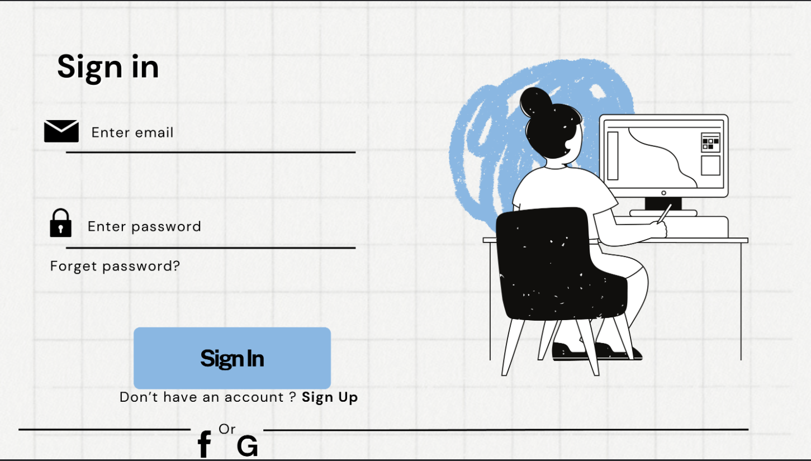
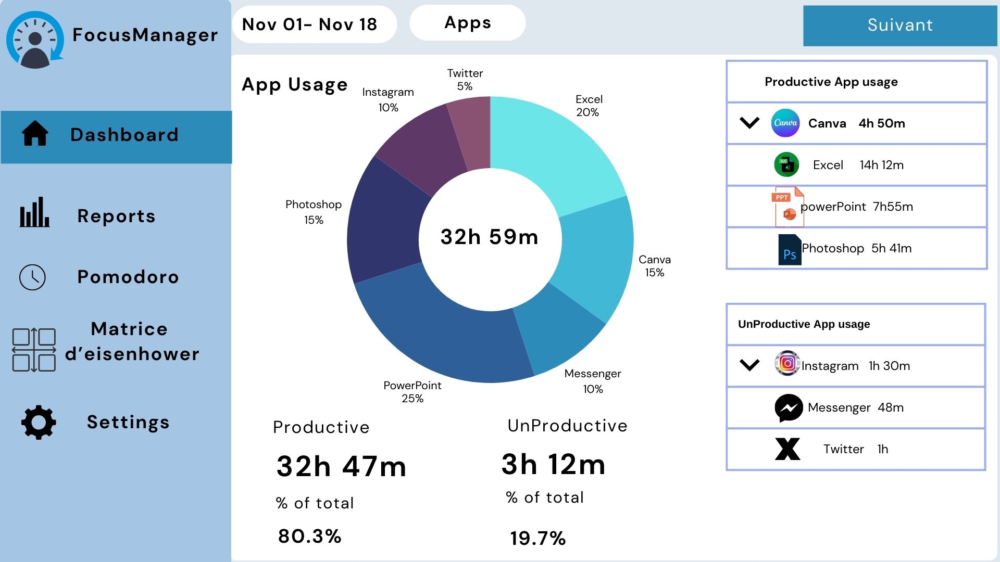
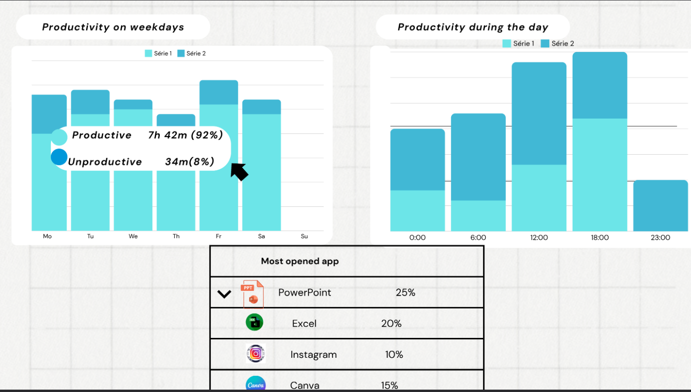
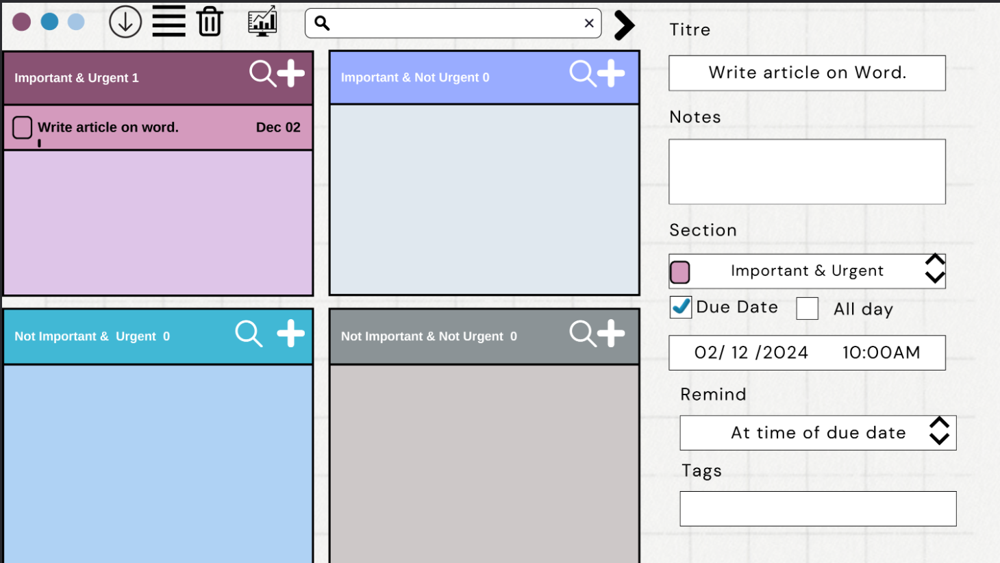
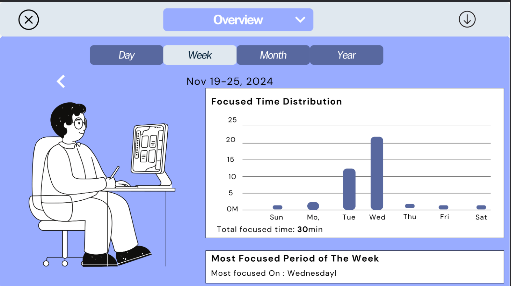
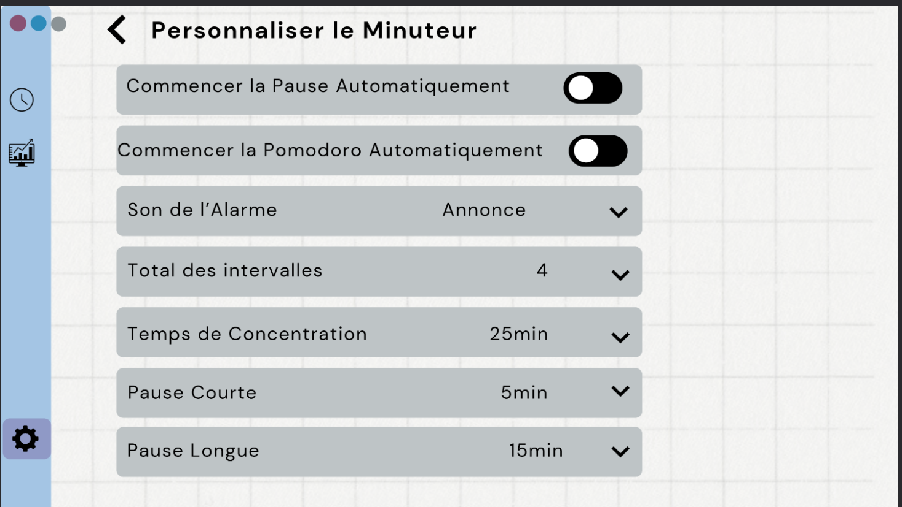

<h1>FocusManager</h1>

FocusManager is a desktop application designed to boost productivity by helping users efficiently manage their time on the computer. It features time tracking, a Pomodoro timer, task management using an Eisenhower matrix, and statistical reports for insights into productivity.
<h3>Main Features</h3>

    Dashboard:
        Overview of total time spent on applications.
        Displays active tasks and completed Pomodoro sessions.
    Application Tracking:
        Lists frequently used applications and websites by time spent.
        Allows users to set usage limits and receive alerts when exceeded.
    Eisenhower Matrix for Task Management:
        Organize tasks into quadrants based on priority (Urgent-Important, Important, etc.).
        Mark tasks as completed or pending.
    Pomodoro Timer:
        Customizable timer for work sessions and breaks.
        Tracks completed Pomodoro sessions daily.
    Statistical Reports:
        Visual reports (charts) showing time usage and task progress.
        Generates daily, weekly, and monthly productivity summaries.

<h3>Optional Features</h3>

    Personalized notifications (Pomodoro reminders, application time limits).
    Theme customization for better visual comfort.

<h3>Technical Details</h3>

    Language: Java
    Framework: JavaFX for UI
    Database: MySQL (using Docker for simplified deployment)
    Version Control: GitHub for collaborative development
    Cross-Platform: Compatible with Windows, macOS, and Linux.

<h3>Getting Started Prerequisites</h3>

    Java Development Kit (JDK): Version 17 or higher.
    JavaFX SDK: Ensure JavaFX is configured in your environment.
    Docker: For MySQL database setup (optional).
<h3>Interfaces</h3>

 

 
 
 

 
 
 

 
 
 
 
<h3>Class Diagram</h3> 
 
